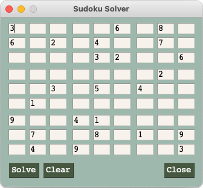

# Sudoku Solver

A Sudoku solver for easy, medium, and hard puzzles.



# Install

After downloading the repository, install the dependencies using the command below. The principal dependency is *PySimpleGUI* which is used to provide a simple user interface.

It's recommended to [activate a virtual environment](https://realpython.com/python-virtual-environments-a-primer/) before installing the dependencies.


```bash
pip install -r requirements.txt
```

# Run

The solver can be run using `python3 gui.py`.

Additionally, there is a menu option `Game` which contains options to `Store` and `Restore` a puzzle.